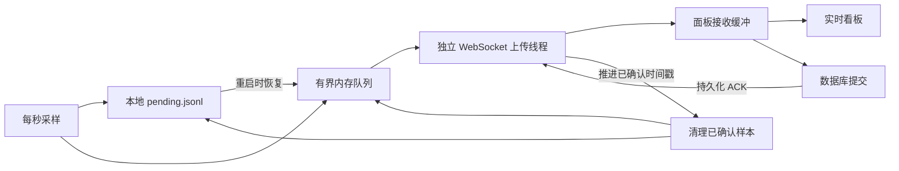

# NodeFlare Agent 与部署设计参考

本次阅读 `/home/mengying/文档/NodeFlare` 的本地代码，参考提交为 `42eff9e07e12d6ec83e003238c1072cc5afdd39e`，工作区没有未提交修改。下述行为来自源码与测试定义，未运行 NodeFlare 的服务或跨平台安装脚本，不代表其线上版本或实机验收结果。

NodeFlare 的 Agent 主要负责主机监控、拨测和远程任务；Sinan 的 Agent 还负责完整配置对账、独立代理运行时与用户流量账本。可以参考连接恢复、部署事务和验证方法，但数据丢弃策略、认证方式与制品来源必须遵守 Sinan 现有 ADR。

## 阅读入口

下表路径均相对于 NodeFlare 仓库。

| 源文件 | 关注内容 |
| --- | --- |
| `agent/src/main.rs` | 采样调度、配置应用、磁盘待上传队列、时间校准、升级检查 |
| `agent/src/metrics.rs`、`gpu.rs`、`probe.rs` | 平台采集、慢指标缓存、子进程超时与拨测 |
| `agent/src/live.rs`、`live_batch.rs` | WebSocket、上传批次、持久化确认与重连退避 |
| `agent/src/runtime_stats.rs` | 队列丢弃、连接与持久化失败、采集耗时统计 |
| `shared/telemetry.rs` | 公共数据结构、静态信息去重、gzip 编解码及大小限制 |
| `backend/src/websocket/agent.rs`、`ingest.rs` | 认证、连接替换、实时广播、缓冲与落库确认 |
| `agent/src/update.rs`、`remote.rs` | 自更新和远程任务的隔离边界，仅作设计参考 |
| `agent/agent.sh` | Linux libc 选择、systemd/OpenRC 安装、手动升级与回滚 |
| `agent/install-macos.sh`、`install-freebsd.sh`、`install.ps1` | 各平台监督方式、目录、凭据权限与回滚 |
| `install.sh`、`Dockerfile` | 面板安装事务、配置保留、容器运行用户与持久化 |
| `.github/workflows/release.yml`、`docker.yml` | 制品矩阵、版本校验、发布门槛、镜像验证 |
| `scripts/agent-runtime-test.mjs`、`agent/src/tests.rs`、`frontend/src/agentInstall.test.ts`、`install.test.ts`、`installerOutput.test.ts` | 真实 Agent 进程、故障恢复与安装参数测试 |

## Agent 的数据链路

### 采样、上传与落库分别调度

- CPU、网速等每秒采样；默认至少每三秒批量上传。`collect_interval` 在配置和协议中实际控制上传周期，`report_interval` 控制历史持久化间隔，不能把两者理解为采样周期。
- 静态信息默认每五分钟刷新，磁盘、进程、连接数及 GPU 等慢指标默认每五秒刷新并缓存；外部采集命令有超时。慢指标刷新仍可能占用采样线程，代码在读取 CPU/网络计数时确定样本时间，避免延后时间戳。
- 采集与上传在不同线程。网络握手、等待 ACK 和连接退避不会直接阻塞采样；调度使用 `Instant`，过期 deadline 跳到下一次未来时刻，避免补跑所有错过的周期。
- 公共 codec 把静态信息从每个动态样本中取出，仅在改变时发送；每次重连重发静态信息。动态样本使用 gzip 批量编码，限制样本数、批次字节和解压后大小。

Sinan 已把静态信息与动态指标拆成消息，并在重连和运行时版本变化后发送静态信息；当前指标周期为十秒，流量周期为三十秒。后续优化应先测量采集耗时和连接负载，不因参考项目每秒采样而改变现有协议或引入高频模式。

### 接收到数据和持久化数据是两件事

NodeFlare 上传线程分别维护已经发送的时间戳与已经持久化的时间戳。面板可以先把样本广播给看板并留在接收缓冲，落库后才通过 `persistedThroughTs` 告知 Agent 可清理到哪一条。断线后发送游标退回持久化位置，重传未确认数据；收到 `persistenceError` 或 ACK 超时会重建连接。

本地样本按行追加到 `pending.jsonl`，压缩队列时使用临时文件、`sync_data` 和重命名，压缩间隔至少三十秒。逐条追加没有每条 fsync，因此不能将它描述为每个采样点都具有断电持久性。

监控队列上限为 720 条，溢出会丢最旧样本；每秒一条时约为十二分钟。加载时还拒绝超过 64 MiB 的待上传文件，并裁剪过期样本；写盘失败允许继续使用内存队列。这是有损监控策略，**不能用于 Sinan 的用户流量账本**。

Sinan 的 [ADR 0004](adr/0004-durable-usage-accounting.md) 已要求累计基准、递增序号与 outbox 在同一个 SQLite 事务提交；面板按服务器、`epoch`、`seq` 幂等入账，事务提交后确认。继续保持这一机制，不能改用监控时间戳去重、队列满时删除未确认批次或忽略账本写入失败。

### 连接恢复与能力协商

NodeFlare 在 WebSocket 握手中发送协议版本和必需能力，服务端不兼容时返回升级提示。握手有时间预算，同源重定向最多三次，跨源重定向被拒绝，避免转交 Bearer 凭据。重连使用有上限的指数退避与按设备 token 派生的抖动，并在收到正常 ACK 后重置退避。

面板用独立连接编号替换同设备的旧连接。处理数据前再次检查当前连接，旧连接退出时仅清理自己的注册，避免把后来建立的连接从在线表中删掉。

Sinan 已有指数退避、随机抖动、握手超时、失活检查和周期性会话更新；一次性注册后使用设备 Ed25519 挑战签名与短时会话。保留这套身份设计及 [ADR 0009](adr/0009-forward-compatible-envelope.md) 的未知字段、未知消息兼容规则，不照搬 NodeFlare 的长期 Bearer token 或 `deny_unknown_fields`。

Sinan 面板同样用连接编号保护退出清理，但当前替换连接表记录后没有主动关闭旧连接，也没有在每次接收时复核连接编号。后续可参考 NodeFlare 的连接替换保护，测试同一设备两条连接的并发上报与退出顺序，明确旧连接停止处理消息的边界。

## 部署与升级链路

### 下载完成后先验证，再修改运行中的安装

NodeFlare 的 Linux Agent 安装顺序是：

1. 检查系统、架构、libc、init 与参数，选择对应制品。
2. 从 Release 元数据取得版本和 SHA-256，下载到临时文件。
3. 校验摘要，实际执行临时二进制的 `--version`，核对声明版本。
4. 备份旧二进制和服务定义，确认旧进程停止后替换文件。
5. 写入服务定义并启动；systemd 分支观察十秒内服务持续 active 且主 PID 不变，发现启动循环时返回失败。
6. 成功后解除回滚状态；失败时恢复旧文件和旧服务。若回滚本身失败，保留备份并报告路径。

Linux 手动升级读取已安装服务中的 endpoint、token 和间隔，不再提示重新配置；macOS、FreeBSD 与 Windows 分别按本机配置格式读取。面板安装同样备份程序、前端目录和服务定义，并在升级时保留现有配置。

Sinan 当前安装已在下载后校验 SHA-256，并用暂存 Agent 成功注册后才原子切换 `current`；Agent 的 TOML 解析保留自定义路径与设备 origin，安装不重启代理运行时。**仍有差距：切换后的启动观察和 Agent 安装文件回滚尚未覆盖**。运行时配置对账的意图恢复与回滚不等于 Agent 安装回滚。

后续增强应继续从面板下载，遵循 [ADR 0010](adr/0010-panel-only-downloads.md)。NodeFlare 的 GitHub 下载镜像、升级时复用长期 token、直接访问上游 Release 的方式不适合 Sinan；Sinan 升级仍使用面板新生成的一次性安装命令。

### 各平台使用原生监督方式

| 平台 | NodeFlare 的监督方式 | 状态与配置安排 |
| --- | --- | --- |
| Linux systemd | 独立 unit，退出自动重启 | token 放入受限权限 unit 的环境变量，状态位于 `/etc/nodeflare/agent` |
| Linux OpenRC | `supervise-daemon`，default runlevel | 独立 init 脚本与持久状态目录 |
| macOS arm64 | 系统 LaunchDaemon，`KeepAlive` | plist 环境变量，状态放在系统 Application Support 目录，独立日志文件 |
| FreeBSD amd64/arm64 | `rc.d`、`rc.subr` 与 `daemon -r` | `sysrc` 启用开机启动，状态位于 `/var/db/nodeflare/agent`，日志交给 syslog |
| Windows x64 | SYSTEM 账号的开机计划任务与启动脚本 | Program Files 存程序，ProgramData 存 JSON 配置，ACL 限制 SYSTEM/管理员读取 |

Windows 实现使用计划任务，并非 Windows Service；本次阅读的制品矩阵也没有 Windows arm64。FreeBSD CI 在 15 VM 检查交叉产物的版本，不能由此推断已经验证 FreeBSD 13 的兼容性。

Sinan 非 Linux 平台目前仅提供编译产物与 CLI 检查，部署仍限 Linux systemd/OpenRC，详见 [ADR 0015](adr/0015-agent-build-platforms.md) 和 [ADR 0016](adr/0016-openrc-services.md)。未来若单独授权完整跨平台部署，需要同时处理服务监督、路径、权限、IPC、特权操作及代理运行时制品；仅移植安装脚本不够。

### 制品、版本与镜像验证

NodeFlare 把版本从 tag 解析一次后传给前端、后端、Agent 与打包步骤，使用 `--version` 核对产物。Linux glibc 使用固定 digest 的 manylinux 2.28 容器并检查实际引用的 GLIBC 符号；musl 检查 ELF 没有动态解释器。制品生成后附构建证明，Release 等待依赖审计、质量检查和构建任务成功。

Sinan 按用户要求使用 Ubuntu 24.04 动态库基线，继续保留这一选择。参考价值在于检查实际二进制及其依赖，不是将基线替换为 manylinux；当前 CI 已检查架构、动态依赖、CLI、校验清单与不可覆盖的产物目录。

NodeFlare 的 Docker 流水线一次解析基础镜像 digest，双架构分别构建并启动测试，成功后推送各自 digest，最后汇成多架构标签。最终容器使用固定非 root UID，数据目录单独持久化。Sinan 当前非 root 面板与 PostgreSQL Compose 已具有相应边界，发布镜像可参考其“验证同一输入后再发布”的流程。

## Sinan 后续可采用的改进顺序

以下是源码对照后得到的建议，尚未实现，不改变当前 MVP 验收结论。

| 顺序 | 改进 | 必须保留的约束 | 验证场景 |
| --- | --- | --- | --- |
| 1 | Agent 安装事务：版本校验、切换后启动观察、失败恢复旧链接及服务定义 | 新注册命令、既有身份与自定义路径；只操作 Agent，代理运行时继续运行 | 版本不符、切换失败、首次安装失败、升级启动失败、启动循环、回滚失败保留证据 |
| 2 | 连接替换保护与故障恢复的真实 Agent 进程测试 | 使用当前协议和本地面板夹具，不引入远程执行或自更新 | 同设备双连接及旧连接退出、TCP 接收后不完成握手、ACK 丢失、断线后重启、长时间离线；确认重传幂等且运行时 PID 不变 |
| 3 | 本地可观测性与有界读取 | 未确认流量保持持久化，不通过丢弃批次限制空间 | 连接失败/恢复次数、待确认数量与最早时间、采样耗时；大 backlog 分页读取，避免一次载入全部账本 |
| 4 | 发布时校验制品声明与真实依赖 | Ubuntu 24.04、已确定的平台矩阵与面板制品目录 | Linux 实际 ABI、版本与 SHA-256；与已校验二进制相同输入的镜像启动检查 |

第一项必须区分文件回滚与身份、会话、数据库状态回滚。注册成功可能已经在面板消费 token；恢复旧链接不能撤销这次注册，也不能恢复旧账本快照覆盖升级期间的新计量记录。应保留既有设备身份与账本，验证同设备重新注册后旧二进制仍可认证。

第三项已有基础：Sinan 的本地 status 提供连接状态、模块健康与待确认批次数；可在此基础上增加失败次数、最早待确认时间与耗时。当前发送队列每次最多取 64 批，但 `pending_usage()` 先读取全部未确认批次；后续应把读取限制放进数据库查询，保持磁盘账本完整。

第二项可以复用 Sinan 的现有进程内端到端测试和 OpenRC 夹具思路，增加进程级故障注入；源码中存在 NodeFlare 的测试并不表示本次已执行那些测试。其正式自更新、远程命令、GPU、告警和公开监控看板均不因本次参考自动纳入 Sinan。
