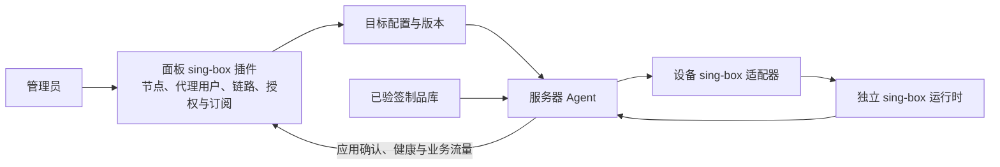

# sing-box 插件安装与控制流程

Sinan 的 sing-box 面板插件管理代理业务；服务器上的 Agent 和 sing-box 适配器将配置应用到本机独立的运行时服务。服务器只需要接入一个 Sinan Agent。代理用户、节点、链路、订阅和套餐都在 **sing-box 插件** 中管理；系统管理员和服务器监控仍在原有系统/服务器页面。

## 操作顺序

1. 在“服务器”创建并接入设备，确认 Agent 在线且支持 sing-box。Agent 的安装命令只用于接入设备。
2. 在“系统 → 插件设置”点击“启用并安装 sing-box”。面板安排配置，Agent 下载并校验面板已导入的对应平台签名制品，安装固定版本运行时。无节点时不会开放用户代理端口。
3. 在“sing-box 插件 → 代理节点”创建直连节点；需要两跳时切换到“两跳链路”分类，选择独立入口和另一台服务器的 Reality 出口。公开地址必须是客户端实际可访问的入口。
4. 创建代理用户。普通节点可以单独授权，也可以加入策略组；链路通过包含它的策略组授权。需要流量、重置周期和到期限制时另分配套餐。
5. 在服务器详情确认目标配置已应用且健康，再使用代理用户的订阅。链路还需两端都应用成功。保存资源与实际代理可用分别显示。

支持插件不等于已启用，启用也不等于已安装。服务器插件列表展示等待设备、等待应用、失败或已确认运行；在线状态与安装状态分别显示，历史成功不作为当前运行就绪。

## 安装失败的处理

缺少签名制品时，先在“系统 → 制品”导入可信发布的 sing-box 1.14.2 对应平台制品，再等待 Agent 自动重试。平台信息未知、libc 不受支持或签名校验失败时，页面保留具体原因；不能通过导入无签名脚本跳过。设备未声明支持时检查 Agent 的版本和运行模式；纯监控模式不会启动业务适配器。运行时配置或健康检查失败时，查看服务器详情的部署错误和已有版本。

修改节点或授权后，面板合并发布配置，设备离线期间保留待办，重连后继续。新配置失败时保留已有恢复机制；安装页不宣称所有长连接更新无中断。当前“启用并安装”不是卸载接口，删掉能力声明或移除清单也不能替代服务停止确认。

已有用户 ID、节点密钥、授权、旧 `/sub/{token}` 和历史流量继续可用。配额周期与计数器重置分开；详见[策略与套餐](singbox-groups.md)。签名导入及 Agent 接入见[部署说明](deploy.md)。

独立验收记录见[双端插件安装与恢复](acceptance/singbox-plugin-installation.md)，区分源码测试、专用节点实际安装和仍未验证的公网/生产范围。
